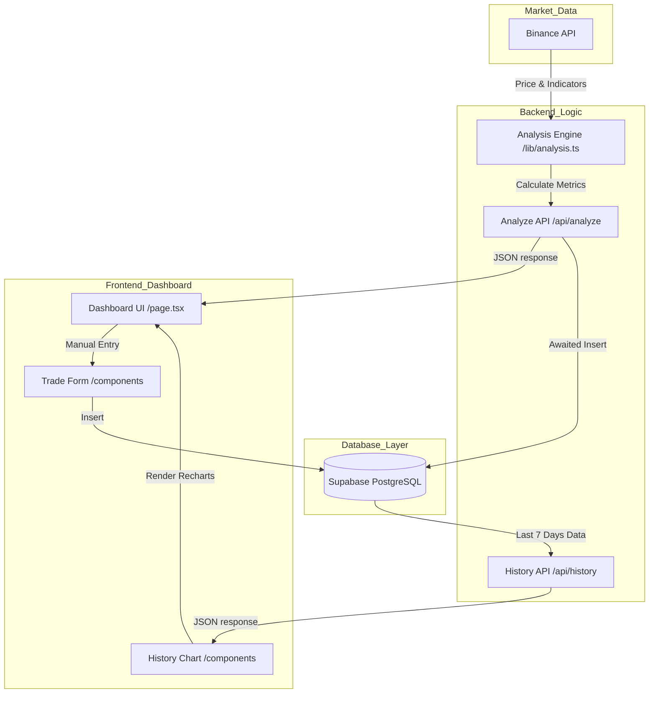

# 🗺️ Crypto Sentinel - UI ＆ System Flow

このドキュメントは、システムのデータフローと画面遷移を図解したものです。外部 AI が「システムがどのように連携して動いているか」を視覚的に把握するための資料です。

## 🌊 データライフサイクル（システム構成図）

---

## 📱 画面の構成 ＆ インタラクション

### 1. メインダッシュボード (`/`)
- **Header**: 
  - プロジェクトステータス（元手40万、月利目標など）の表示。
  - **「🔄 更新」ボタン**: 手動で `/api/analyze` を叩き、最新の分析結果を取得。
  - **「新規取引を記録」ボタン**: `TradeForm` モダールを起動。
- **Coin Cards (BTC, ETH, XRP)**:
  - 左上: 現在価格、24h 変動。
  - 右上: 総合シグナル（STRONG BUY 等）。
  - 中央: エントリー推奨メッセージ（「10万円投資」など）。
  - 中央下: シグナルスコアゲージ（-100 〜 +100）。
  - 下部: 詳細指標（RSI, MACD, BB, SMAクロス状態）。
  - 最下部: **History Chart**（過去7日間のスコア推移グラフ）。

---

### 🔄 画面更新フロー
1.  **ブラウザアクセス**: 初回ロード時に `useEffect` で `/api/analyze` を呼び出し。
2.  **API 処理**: 
    - 市場データを取得し、ロジックを実行。
    - **Cloudflare Worker 上で DB 保存（INSERT）が完了するまで待機（await）**。
    - 完了後、最新データをブラウザへ返却。
3.  **UI 描画**: 
    - 各カードの数値、色、ゲージ、チャートが同期して更新。

---

## 📝 入力フロー（取引記録）
1.  **ボタン押下**: `TradeForm` がオーバーレイで開く。
2.  **入力**: 対象ペア、エントリー価格（自動入力可）、投資額を入力。
3.  **保存**: `supabase-js` を用いてクライアントサイドから直接 `trades` テーブルへ INSERT。
4.  **完了**: 成功アラートを表示し、入力を終了。
